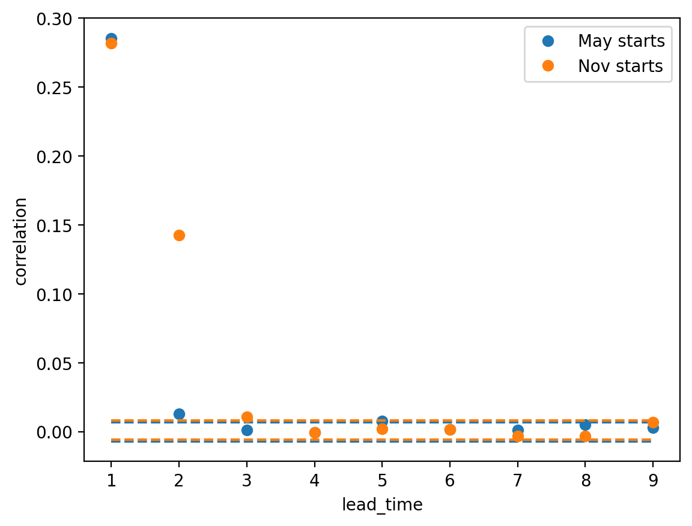
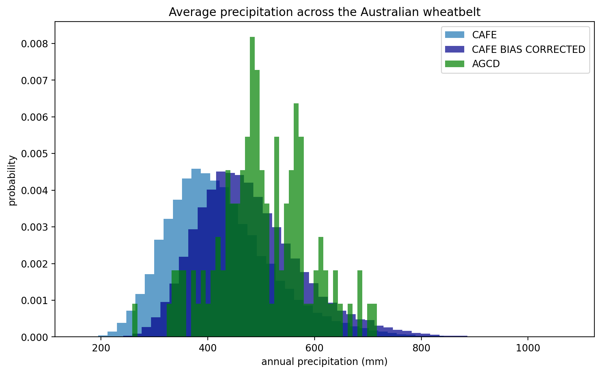
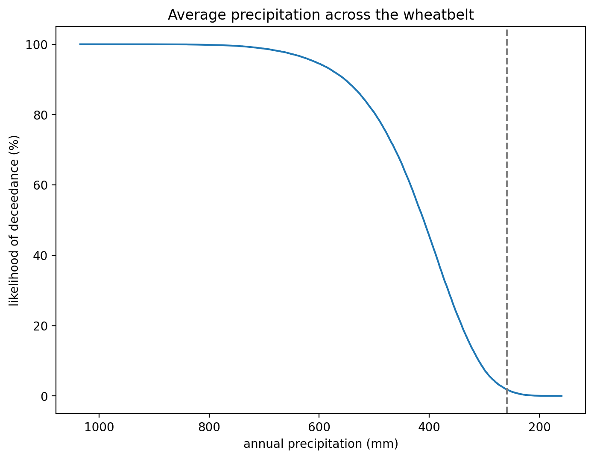

Worked examples
===============

Wheatbelt rainfall
------------------

The year 2019 was the driest on record for the Australian wheatbelt.
So dry, in fact, that wheat was imported into the country for the first time since 2006.

In this worked example,
we'll put this record dry year in context by applying the UNSEEN approach to
an observational dataset (AGCD)
and a large forecast ensemble from the Decadal Climate Prediction Project (DCPP).

Observational data
^^^^^^^^^^^^^^^^^^

We can use the `AGCD data available on NCI <https://dx.doi.org/10.25914/6009600786063>`__:

.. code-block:: python

    import glob

    agcd_files = glob.glob('/g/data/zv2/agcd/v2-0-1/precip/total/r005/01month/agcd_v2-0-1_precip_total_r005_monthly_*.nc')
    agcd_files.sort()
    print(agcd_files)

.. code-block:: none

    ['/g/data/zv2/agcd/v2-0-1/precip/total/r005/01month/agcd_v2-0-1_precip_total_r005_monthly_1900.nc',
     '/g/data/zv2/agcd/v2-0-1/precip/total/r005/01month/agcd_v2-0-1_precip_total_r005_monthly_1901.nc',
     ...
     '/g/data/zv2/agcd/v2-0-1/precip/total/r005/01month/agcd_v2-0-1_precip_total_r005_monthly_2021.nc',
     '/g/data/zv2/agcd/v2-0-1/precip/total/r005/01month/agcd_v2-0-1_precip_total_r005_monthly_2022.nc']

The ``fileio.open_dataset`` function can be used to open a data file/s as an xarray Dataset:

.. code-block:: python

    from unseen import fileio

    agcd_ds = fileio.open_dataset(
        agcd_file,
        variables=['pr'],
        shapefile='wheatbelt.zip',
        spatial_agg='mean',
        time_freq='A-DEC',
        time_agg='sum',
        input_freq='M',
        metadata_file='../../config/dataset_agcd_monthly.yml',
        complete_time_agg_periods=True
    )

In addition to opening the AGCD file,
we've asked the function to:

-  Edit the metadata of the data file / xarray Dataset according to the details in a :doc:`configuration file <configuration_files>`
-  Select the precipitation variable from the Dataset
-  Calculate the spatial mean across the wheatbelt (as defined in a shapefile)
-  Convert the monthly timescale data to an annual sum and only retain years where data for all months are available 

.. code-block:: python

    print(agcd_ds)

.. code-block:: none

    <xarray.Dataset>
    Dimensions:  (time: 123)
    Coordinates:
      * time     (time) object 1900-12-31 00:00:00 ... 2022-12-31 00:00:00
    Data variables:
        pr       (time) float32 dask.array<chunksize=(1,), meta=np.ndarray>
    Attributes: (12/33)
        geospatial_lat_min:        -44.525
        geospatial_lat_max:        -9.975
        geospatial_lon_min:        111.975
        geospatial_lon_max:        156.275
        time_coverage_start:       1900-01-01T00:00:00
        date_created:              2020-08-27T21:49:15.867624
        ...                        ...
        licence:                   Data Licence: The grid data files in this AGCD...
        description:               This AGCD data is a snapshot of the operationa...
        date_issued:               2023-05-21 22:51:24
        attribution:               Data should be cited as : Australian Bureau of...
        copyright:                 (C) Copyright Commonwealth of Australia 2023, ...
        history:            

It can be a good idea to compute the Dataset before going too much further with the analysis,
otherwise the dask task graph can get out of control.

.. code-block:: python

   agcd_ds = agcd_ds.compute()

.. code-block:: python

   import pandas as pd

   years = agcd_ds['time'].dt.year.values
   agcd_df = pd.DataFrame(index=years)
   agcd_df['pr'] = agcd_ds['pr'].values

   agcd_df['pr'].plot.bar(figsize=[20, 9], width=0.8)
   plt.ylabel('annual precipitation (mm)')
   plt.title(f'Annual mean precipitation over the Australian wheatbelt')
   plt.grid(axis='y')
   plt.show()

.. image:: observational_record.png
   :width: 1000

.. code-block:: python

   ranked_years = agcd_df['pr'].sort_values()
   print(ranked_years.head(n=10))

.. code-block:: none

   2019    258.772963
   2002    331.651974
   1902    334.037246
   1944    341.258801
   1994    341.414517
   1957    344.510548
   1940    353.472467
   2006    357.692126
   1982    373.436263
   1919    377.921436
   Name: pr, dtype: float64

Analysis of the AGCD data shows that 2019 was indeed an unprecented dry year with an average annual rainfall
over the wheatbelt of only 259mm. 

Model data
^^^^^^^^^^

The CanESM5 submission to DCPP consists of multiple forecast files - one for each initialisation date and ensemble member.
We can pass a text file listing all the input forecast files to ``fileio.open_mfforecast`` and it will sort and process
them into a single xarray dataset.
We just need to order the files in the list by initialisation date and then ensemble member. For example,

.. code-block:: none

    cat CanESM5_dcppA-hindcast_pr_files.txt

.. code-block:: none    

    /g/data/oi10/replicas/CMIP6/DCPP/CCCma/CanESM5/dcppA-hindcast/s1960-r1i1p2f1/day/pr/gn/v20190429/pr_day_CanESM5_dcppA-hindcast_s1960-r1i1p2f1_gn_19610101-19701231.nc
    /g/data/oi10/replicas/CMIP6/DCPP/CCCma/CanESM5/dcppA-hindcast/s1960-r2i1p2f1/day/pr/gn/v20190429/pr_day_CanESM5_dcppA-hindcast_s1960-r2i1p2f1_gn_19610101-19701231.nc
    /g/data/oi10/replicas/CMIP6/DCPP/CCCma/CanESM5/dcppA-hindcast/s1960-r3i1p2f1/day/pr/gn/v20190429/pr_day_CanESM5_dcppA-hindcast_s1960-r3i1p2f1_gn_19610101-19701231.nc
    ...
    /g/data/oi10/replicas/CMIP6/DCPP/CCCma/CanESM5/dcppA-hindcast/s1960-r18i1p2f1/day/pr/gn/v20190429/pr_day_CanESM5_dcppA-hindcast_s1960-r18i1p2f1_gn_19610101-19701231.nc
    /g/data/oi10/replicas/CMIP6/DCPP/CCCma/CanESM5/dcppA-hindcast/s1960-r19i1p2f1/day/pr/gn/v20190429/pr_day_CanESM5_dcppA-hindcast_s1960-r19i1p2f1_gn_19610101-19701231.nc
    /g/data/oi10/replicas/CMIP6/DCPP/CCCma/CanESM5/dcppA-hindcast/s1960-r20i1p2f1/day/pr/gn/v20190429/pr_day_CanESM5_dcppA-hindcast_s1960-r20i1p2f1_gn_19610101-19701231.nc
    /g/data/oi10/replicas/CMIP6/DCPP/CCCma/CanESM5/dcppA-hindcast/s1961-r1i1p2f1/day/pr/gn/v20190429/pr_day_CanESM5_dcppA-hindcast_s1961-r1i1p2f1_gn_19620101-19711231.nc
    /g/data/oi10/replicas/CMIP6/DCPP/CCCma/CanESM5/dcppA-hindcast/s1961-r2i1p2f1/day/pr/gn/v20190429/pr_day_CanESM5_dcppA-hindcast_s1961-r2i1p2f1_gn_19620101-19711231.nc
    /g/data/oi10/replicas/CMIP6/DCPP/CCCma/CanESM5/dcppA-hindcast/s1961-r3i1p2f1/day/pr/gn/v20190429/pr_day_CanESM5_dcppA-hindcast_s1961-r3i1p2f1_gn_19620101-19711231.nc
    ...
    /g/data/oi10/replicas/CMIP6/DCPP/CCCma/CanESM5/dcppA-hindcast/s2016-r18i1p2f1/day/pr/gn/v20190429/pr_day_CanESM5_dcppA-hindcast_s2016-r18i1p2f1_gn_20170101-20261231.nc
    /g/data/oi10/replicas/CMIP6/DCPP/CCCma/CanESM5/dcppA-hindcast/s2016-r19i1p2f1/day/pr/gn/v20190429/pr_day_CanESM5_dcppA-hindcast_s2016-r19i1p2f1_gn_20170101-20261231.nc
    /g/data/oi10/replicas/CMIP6/DCPP/CCCma/CanESM5/dcppA-hindcast/s2016-r20i1p2f1/day/pr/gn/v20190429/pr_day_CanESM5_dcppA-hindcast_s2016-r20i1p2f1_gn_20170101-20261231.nc

.. code-block:: python

   cafe_ds = fileio.open_mfforecast(
       'CanESM5_dcppA-hindcast_pr_files.txt',
       n_ensemble_files=20,
       variables=['pr'],
       lat_bnds=[-44, -11],
       lon_bnds=[113, 154],
       shapefile='wheatbelt.zip',
       spatial_agg='mean',
       time_freq='A-DEC',
       time_agg='sum',
       input_freq='D',
       reset_times=True,
       complete_time_agg_periods=True,
       units={'pr': 'mm day-1'},
       units_timing='middle'
   )

We've used similar keyword arguments as for the AGCD data
(``open_mfforecast`` uses ``open_dataset`` to open each individual file)
with a couple of additions:

-  The ``n_ensemble_members`` argument helps the function sort the contents of the input file list 
-  Selecting a box region (using the ``lat_bnds`` and ``lon_bnds`` arguments) around your shapefile region can help reduce the memory required to work with the shapefile
-  The ``reset_times`` option ensures that after resampling (e.g. here we calculate the annual mean from daily data) the month assigned to each time axis value matches the initialisation month 
-  The ``units`` option allows you to convert the units of particular variables. You can choose (using the ``units_timing`` option) for the conversion to happen at the start (before spatial and temporal operations), middle (after the spatial but before the temporal operations) or end.

.. code-block:: python

   print(model_ds)
   

.. code-block:: none

    <xarray.Dataset>
    Dimensions:    (init_date: 57, ensemble: 20, lead_time: 10)
    Coordinates:
      * lead_time  (lead_time) int64 0 1 2 3 4 5 6 7 8 9
      * ensemble   (ensemble) int64 0 1 2 3 4 5 6 7 8 ... 11 12 13 14 15 16 17 18 19
      * init_date  (init_date) object 1961-01-01 00:00:00 ... 2017-01-01 00:00:00
        time       (lead_time, init_date) object 1961-01-01 12:00:00 ... 2026-01-...
    Data variables:
        pr         (init_date, ensemble, lead_time) float32 dask.array<chunksize=(1, 1, 1), meta=np.ndarray>
    Attributes: (12/53)
        CCCma_model_hash:            Unknown
        CCCma_parent_runid:          d2a-asm-e01
        CCCma_pycmor_hash:           13db8596c37129e414cad7ae31f2927ca8f5dd39
        CCCma_runid:                 d2a196101e01
        Conventions:                 CF-1.7 CMIP-6.2
        YMDH_branch_time_in_child:   1961:01:01:00
        ...                          ...
        tracking_id:                 hdl:21.14100/f220e01c-1214-4625-be6a-c0475c2...
        variable_id:                 pr
        variant_label:               r1i1p2f1
        version:                     v20190429
        license:                     CMIP6 model data produced by The Government ...
        cmor_version:                3.4.0

Stability and stationarity testing
^^^^^^^^^^^^^^^^^^^^

Now that we have our annual rainfall data for the wheatbelt region,
we need to check with the dataset is stable (no drift/trend with lead time)
and stationary (no trend with time).
To do this, we can use the ``stability`` module:

.. code-block:: python

    from unseen import stability

    stability.create_plot(
        model_ds['pr'],
        'annual mean rainfall',
        [1960, 1970, 1980, 1990, 2000, 2010],
        outfile='wheatbelt_stability_CanESM5.png',
        uncertainty=True,
        return_method='empirical',
        ymax=None,
    )

.. image:: wheatbelt_stability_CanESM5.png
   :width: 800

Independence testing
^^^^^^^^^^^^^^^^^^^^

Next we want to ensure that each sample in our model dataset is independent.
To do this, we can use the ``independence`` module:

.. code-block:: python

   from unseen import independence

   mean_correlations, null_correlation_bounds = independence.run_tests(cafe_da_bc)

For each initialisation time/month,
``run_tests`` calculates the mean correlation between all the ensemble members (for each lead time)
as well as the bounds on zero correlation based on random sampling.

.. code-block:: python
    
   print(mean_correlations)   

.. code-block:: none

   {5: <xarray.DataArray (lead_time: 11)>
 dask.array<mean_agg-aggregate, shape=(11,), dtype=float64, chunksize=(11,), chunktype=numpy.ndarray>
 Coordinates:
   * lead_time  (lead_time) int64 0 1 2 3 4 5 6 7 8 9 10,
 11: <xarray.DataArray (lead_time: 11)>
 dask.array<mean_agg-aggregate, shape=(11,), dtype=float64, chunksize=(11,), chunktype=numpy.ndarray>
 Coordinates:
   * lead_time  (lead_time) int64 0 1 2 3 4 5 6 7 8 9 10} 

The mean correlations and null correlation bounds can then be plotted:

.. code-block:: python

   independence.create_plot(
       mean_correlations,
       null_correlation_bounds,
       'wheatbelt_independence.png'
   )

(Lead time 0 and 10 aren't present in the plot because they didn't contain data for the full year.)

In this case we only want to retain lead time 3 onwards.
At this point we shouldn't use ``cafe_ds['pr'].sel({'lead_time': slice(3, None)}`` to remove the unwanted lead times
(for some of the array operations performed in the bias correction the data needs to retain its original shape),
but we can set unwanted values to NaN.

.. code-block:: python

   cafe_da_indep = cafe_ds['pr'].where(cafe_ds['lead_time'] > 2)

Bias correction
^^^^^^^^^^^^^^^

In order to bias correct the (independent) model data,
we can use the ``bias_correction`` module:

.. code-block:: python

   from unseen import bias_correction

   bias = bias_correction.get_bias(
       cafe_da_indep,
       agcd_ds['pr'],
       'additive',
       time_rounding='A',
       time_period=['2004-01-01', '2019-12-31']
   )
   
   print(bias)

.. code-block:: none

   <xarray.DataArray 'pr' (month: 2, lead_time: 11)>
   array([[         nan,          nan,          nan, -79.73348325,
           -66.94647375, -51.25970312, -54.93298978, -46.39792357,
           -44.19195586, -46.706165  ,          nan],
          [         nan,          nan,          nan, -65.09246704,
           -73.51923507, -52.91778398, -45.92252261, -44.3704739 ,
           -41.02545657, -47.19070081,          nan]])
   Coordinates:
     * lead_time  (lead_time) int64 0 1 2 3 4 5 6 7 8 9 10
     * month      (month) int64 5 11
   Attributes:
       cell_methods:            time: mean
       interp_method:           conserve_order1
       long_name:               Total precipitation rate
       time_avg_info:           average_T1,average_T2,average_DT
       units:                   mm d-1
       climatological_period:   ['2004-01-01', '2019-12-31']
       bias_correction_method:  additive
       bias_correction_period:  2004-01-01-2019-12-31

In this case we're using the additive (as opposed to multiplicative) bias correction method.
The bias represents the difference between model (CAFE) and observed (AGCD) climatology over the period 2004-2019. 
The first initialisation date is 1995, the last initialisation date is 2020, and each forecast is run for 10 years.
Those 10 year windows actually span 11 calendar years but the first and last year are incomplete,
so we end up with 9 annual rainfall values per forecast, the last 7 of which are independent samples.
This means each year over the 2004-2023 period is sampled the same number of times (7 times).
The AGCD data spans 1900-2019, so the common period is 2004-2019.

A separate bias is calculated for each lead time/year.

.. code-block:: python

   cafe_da_bc = bias_correction.remove_bias(cafe_da_indep, bias, 'additive')
   cafe_da_bc = cafe_da_bc.compute()
   print(cafe_da_bc)

.. code-block:: none

   <xarray.DataArray 'pr' (init_date: 52, lead_time: 11, ensemble: 96)>
   array(...)
   Coordinates:
     * lead_time  (lead_time) int64 0 1 2 3 4 5 6 7 8 9 10
     * ensemble   (ensemble) int64 1 2 3 4 5 6 7 8 9 ... 88 89 90 91 92 93 94 95 96
     * init_date  (init_date) object 1995-05-01 00:00:00 ... 2020-11-01 00:00:00
       time       (lead_time, init_date) object 1995-05-01 12:00:00 ... 2030-11-...
   Attributes:
       cell_methods:            time: mean
       interp_method:           conserve_order1
       long_name:               Total precipitation rate
       time_avg_info:           average_T1,average_T2,average_DT
       units:                   mm d-1
       bias_correction_method:  additive
       bias_correction_period:  2004-01-01-2019-12-31 

Similarity testing
^^^^^^^^^^^^^^^^^^

Before conducting the UNSEEN analysis,
the last thing we need to do is determine whether the observed
and (bias corrected, indepdenent) model data have a similar statistical distribution.

We can check visually,

.. code-block:: python

   import matplotlib.pyplot as plt

   fig = plt.figure(figsize=[10, 6])

   cafe_da_indep.plot.hist(bins=50, density=True, label='CAFE', alpha=0.7)
   cafe_da_bc.plot.hist(bins=50, density=True, label='CAFE BIAS CORRECTED', facecolor='darkblue', alpha=0.7)
   agcd_ds['pr'].plot.hist(bins=50, density=True, label='AGCD', facecolor='green', alpha=0.7)

   plt.xlabel('annual precipitation (mm)')
   plt.ylabel('probability')
   plt.title(f'Average precipitation across the Australian wheatbelt')
   plt.legend()
   plt.show()

and/or conduct an appropriate statistical test using the ``similarity`` module.

.. code-block:: python

   from unseen import similarity

   similarity_ds = similarity.univariate_ks_test(cafe_da_bc, agcd_ds, 'pr')
   print(similarity_ds)

.. code-block:: none

   <xarray.Dataset>
   Dimensions:    (lead_time: 7)
   Coordinates:
     * lead_time  (lead_time) int64 3 4 5 6 7 8 9
   Data variables:
       ks         (lead_time) float64 dask.array<chunksize=(1,), meta=np.ndarray>
       pval       (lead_time) float64 dask.array<chunksize=(1,), meta=np.ndarray>

.. code-block:: python

   print(similarity_ds['pval'].values)

.. code-block:: none

   [6.25815783e-04 4.22842520e-04 2.35883442e-05 1.61185358e-05
    1.64659543e-05 2.02715531e-05 2.26184062e-05]

The univariate Kolmogorov-Smirnov (KS) test is used to compare the distributions of two datasets.
The null hypothesis is that the two dataset values are from the same continuous distribution.
The alternative hypothesis is that these two datasets are from different continuous distributions.
In this case p-values less than 0.05 (a commonly used significance threshold) point to null hypothesis being rejected.
In other words,
the test suggests that the AGCD and bias corrected independent AGCD data are from different distributions.

Results
^^^^^^^

Once we've got to the point where our data is procesed
and we are satisified that the observational and (independent, bias corrected) model data
have similar enough statistical distributions,
the ``general_utils`` module has a number of functions to help to express our unpreecedented event
(in this case the 2019 annual rainfall total over the Australian wheatbelt)
in the context of our large ensemble.

Once we've stacked our model data so it's one dimensional,

.. code-block:: python

   cafe_da_indep_stacked = cafe_da_indep.dropna('lead_time').stack({'sample': ['ensemble', 'init_date', 'lead_time']})
   print(cafe_da_indep_stacked)

.. code-block:: none

   <xarray.DataArray 'pr' (sample: 34944)>
   array([444.60986567, 689.77274747, 402.1668014 , ..., 388.06818872,
          523.24595738, 452.023927  ])
   Coordinates:
       time       (sample) object 1998-05-01 12:00:00 ... 2029-11-01 12:00:00
     * sample     (sample) MultiIndex
     - ensemble   (sample) int64 1 1 1 1 1 1 1 1 1 1 ... 96 96 96 96 96 96 96 96 96
     - init_date  (sample) object 1995-05-01 00:00:00 ... 2020-11-01 00:00:00
     - lead_time  (sample) int64 3 4 5 6 7 8 9 3 4 5 6 7 ... 6 7 8 9 3 4 5 6 7 8 9
   Attributes:
       cell_methods:   time: mean
       interp_method:  conserve_order1
       long_name:      Total precipitation rate
       time_avg_info:  average_T1,average_T2,average_DT
       units:          mm d-1

we can plot an exceedance curve
(or in this case a deceedance curve since we are interested in rainfall events below the 2019 value).  

.. code-block:: python

   from unseen import general_utils

   sorted_data, deceedance = general_utils.exceedance_curve(cafe_da_indep_stacked.data, deceedance=True)

   pr2019 = agcd_ds['pr'].data.min()
   print(pr2019)

.. code-block:: none
   
   258.7729632499339

.. code-block:: python

   fig = plt.figure(figsize=[8, 6])
   ax = fig.add_subplot()
   ax.plot(sorted_data, deceedance)
   ax.invert_xaxis()
   ax.set_title(f'Average precipitation across the wheatbelt')
   ax.set_ylabel('likelihood of deceedance (%)')
   ax.set_xlabel('annual precipitation (mm)')
   ax.axvline(pr2019, color='0.5', linestyle='--')
   plt.show()

We can also generate common event statistics such as a percentile or return period.

.. code-block:: python

   percentile, return_period = general_utils.event_in_context(cafe_da_indep_stacked.data, pr2019, 'below')

   print(f'{percentile:.2f}% percentile')
   print(f'{return_period:.0f} year return period')

.. code-block:: none

   1.78% percentile
   56 year return period

     
