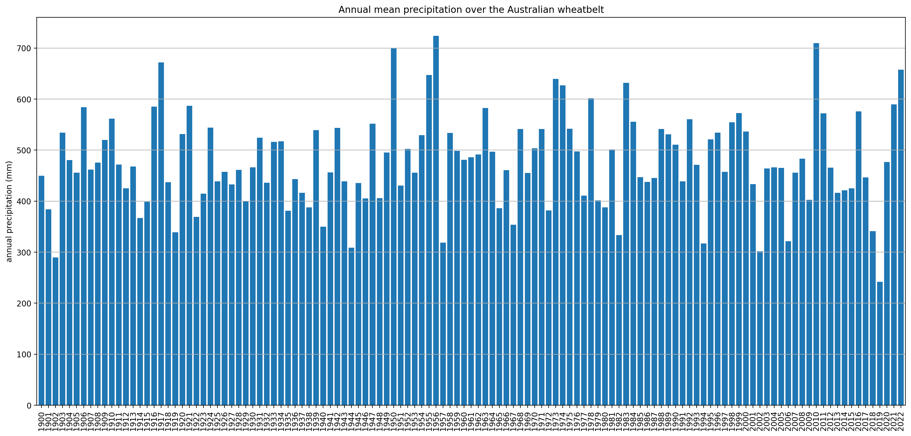
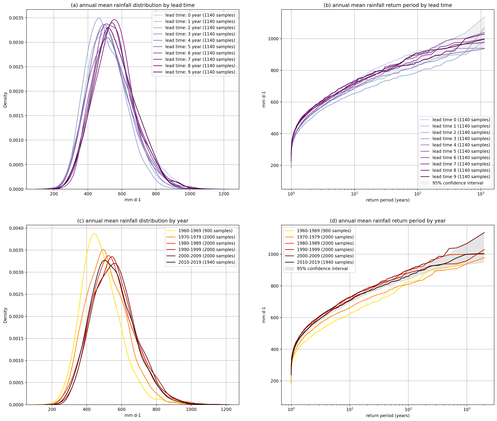
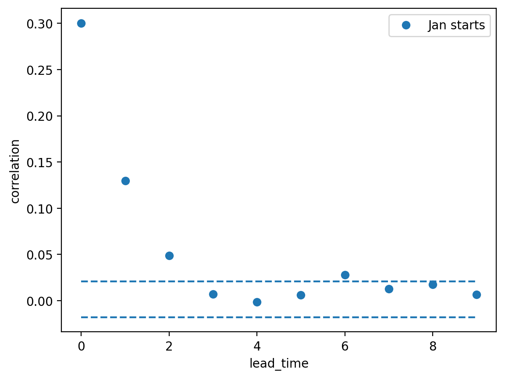
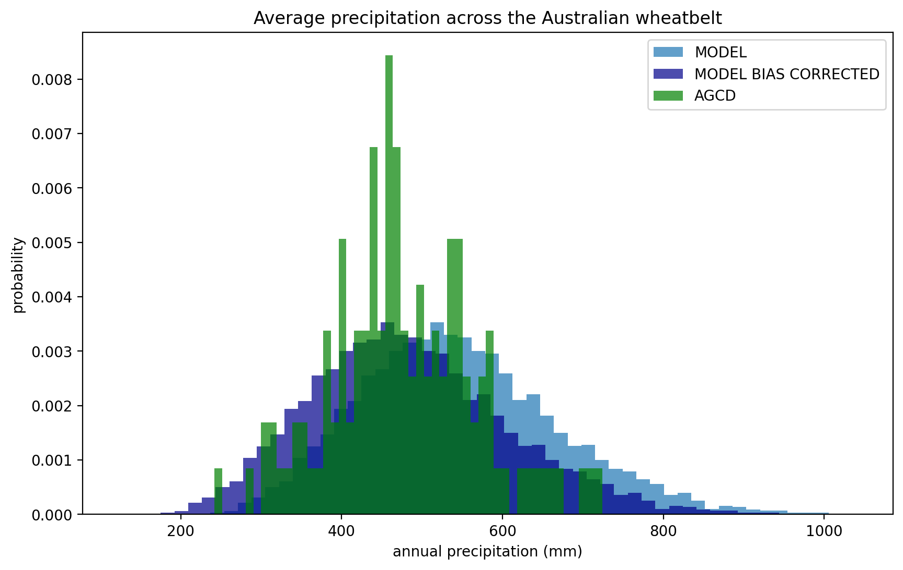
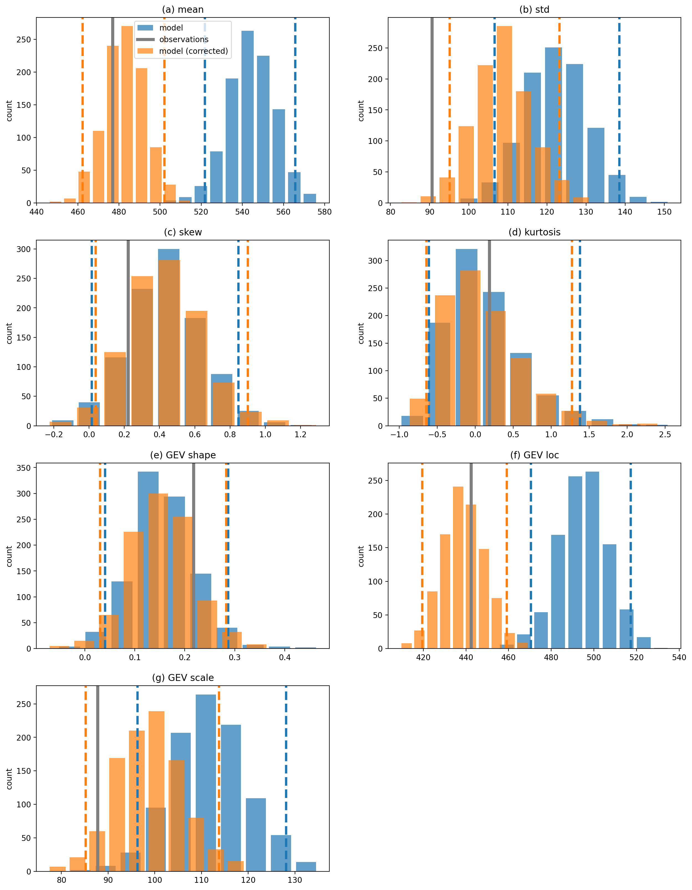
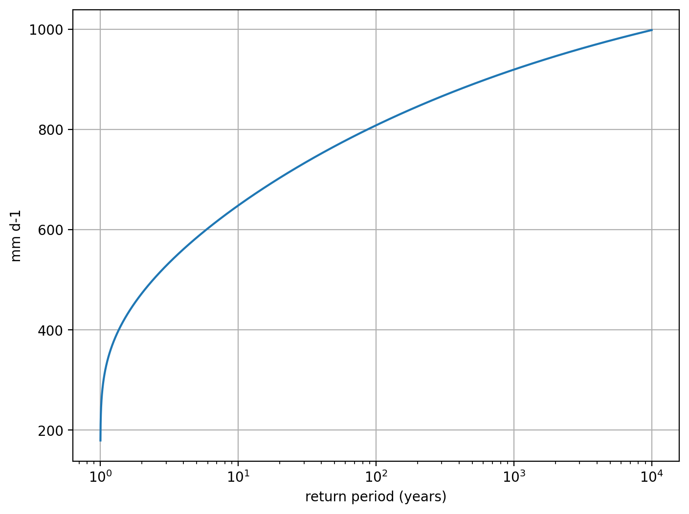

Worked examples
===============

Wheatbelt rainfall
------------------

The year 2019 was the driest on record for the Australian wheatbelt.
So dry, in fact, that wheat was imported into the country for the first time since 2006.

In this worked example,
we'll put this record dry year in context by applying the UNSEEN approach to
an observational dataset (AGCD)
and a large forecast ensemble from the Decadal Climate Prediction Project (DCPP).

Observational data
^^^^^^^^^^^^^^^^^^

We can use the `AGCD data available on NCI <https://dx.doi.org/10.25914/6009600786063>`__:

.. code-block:: python

    import glob

    agcd_files = glob.glob('/g/data/zv2/agcd/v2-0-1/precip/total/r005/01month/agcd_v2-0-1_precip_total_r005_monthly_*.nc')
    agcd_files.sort()
    print(agcd_files)

.. code-block:: none

    ['/g/data/zv2/agcd/v2-0-1/precip/total/r005/01month/agcd_v2-0-1_precip_total_r005_monthly_1900.nc',
     '/g/data/zv2/agcd/v2-0-1/precip/total/r005/01month/agcd_v2-0-1_precip_total_r005_monthly_1901.nc',
     ...
     '/g/data/zv2/agcd/v2-0-1/precip/total/r005/01month/agcd_v2-0-1_precip_total_r005_monthly_2021.nc',
     '/g/data/zv2/agcd/v2-0-1/precip/total/r005/01month/agcd_v2-0-1_precip_total_r005_monthly_2022.nc']

The ``fileio.open_dataset`` function can be used to open a data file/s as an xarray Dataset
and apply simple temporal and spatial aggregation:

.. code-block:: python

    from unseen import fileio

    agcd_ds = fileio.open_dataset(
        agcd_file,
        variables=['pr'],
        shapefile='wheatbelt.zip',
        spatial_agg='mean',
        time_freq='A-DEC',
        time_agg='sum',
        input_freq='M',
        metadata_file='../../config/dataset_agcd_monthly.yml',
        complete_time_agg_periods=True
    )

In addition to opening the AGCD file,
we've asked the function to:

-  Edit the metadata of the data file / xarray Dataset according to the details in a :doc:`configuration file <configuration_files>`
-  Select the precipitation variable from the Dataset
-  Calculate the spatial mean across the wheatbelt (as defined in a shapefile)
-  Convert the monthly timescale data to an annual sum and only retain years where data for all months are available 

.. code-block:: python

    print(agcd_ds)

.. code-block:: none

    <xarray.Dataset>
    Dimensions:  (time: 123)
    Coordinates:
      * time     (time) object 1900-12-31 00:00:00 ... 2022-12-31 00:00:00
    Data variables:
        pr       (time) float32 dask.array<chunksize=(1,), meta=np.ndarray>
    Attributes: (12/33)
        geospatial_lat_min:        -44.525
        geospatial_lat_max:        -9.975
        geospatial_lon_min:        111.975
        geospatial_lon_max:        156.275
        time_coverage_start:       1900-01-01T00:00:00
        date_created:              2020-08-27T21:49:15.867624
        ...                        ...
        licence:                   Data Licence: The grid data files in this AGCD...
        description:               This AGCD data is a snapshot of the operationa...
        date_issued:               2023-05-21 22:51:24
        attribution:               Data should be cited as : Australian Bureau of...
        copyright:                 (C) Copyright Commonwealth of Australia 2023, ...
        history:            

It can be a good idea to compute the Dataset before going too much further with the analysis,
otherwise the dask task graph can get out of control.

.. code-block:: python

   agcd_ds = agcd_ds.compute()

.. code-block:: python

   import pandas as pd

   years = agcd_ds['time'].dt.year.values
   agcd_df = pd.DataFrame(index=years)
   agcd_df['pr'] = agcd_ds['pr'].values

   agcd_df['pr'].plot.bar(figsize=[20, 9], width=0.8)
   plt.ylabel('annual precipitation (mm)')
   plt.title(f'Annual mean precipitation over the Australian wheatbelt')
   plt.grid(axis='y')
   plt.show()

.. code-block:: python

   ranked_years = agcd_df['pr'].sort_values()
   print(ranked_years.head(n=10))

.. code-block:: none

   2019    258.772963
   2002    331.651974
   1902    334.037246
   1944    341.258801
   1994    341.414517
   1957    344.510548
   1940    353.472467
   2006    357.692126
   1982    373.436263
   1919    377.921436
   Name: pr, dtype: float64

Analysis of the AGCD data shows that 2019 was indeed an unprecented dry year with an average annual rainfall
over the wheatbelt of only 259mm. 

Model data
^^^^^^^^^^

The CanESM5 submission to DCPP consists of multiple forecast files - one for each initialisation date and ensemble member.
We can pass a text file listing all the input forecast files to ``fileio.open_mfforecast``
and it will sort and process them into a single xarray dataset.
We just need to order the files in the list by initialisation date and then ensemble member.
For example:

.. code-block:: none

    cat CanESM5_dcppA-hindcast_pr_files.txt

.. code-block:: none    

    /g/data/oi10/replicas/CMIP6/DCPP/CCCma/CanESM5/dcppA-hindcast/s1960-r1i1p2f1/day/pr/gn/v20190429/pr_day_CanESM5_dcppA-hindcast_s1960-r1i1p2f1_gn_19610101-19701231.nc
    /g/data/oi10/replicas/CMIP6/DCPP/CCCma/CanESM5/dcppA-hindcast/s1960-r2i1p2f1/day/pr/gn/v20190429/pr_day_CanESM5_dcppA-hindcast_s1960-r2i1p2f1_gn_19610101-19701231.nc
    /g/data/oi10/replicas/CMIP6/DCPP/CCCma/CanESM5/dcppA-hindcast/s1960-r3i1p2f1/day/pr/gn/v20190429/pr_day_CanESM5_dcppA-hindcast_s1960-r3i1p2f1_gn_19610101-19701231.nc
    ...
    /g/data/oi10/replicas/CMIP6/DCPP/CCCma/CanESM5/dcppA-hindcast/s1960-r18i1p2f1/day/pr/gn/v20190429/pr_day_CanESM5_dcppA-hindcast_s1960-r18i1p2f1_gn_19610101-19701231.nc
    /g/data/oi10/replicas/CMIP6/DCPP/CCCma/CanESM5/dcppA-hindcast/s1960-r19i1p2f1/day/pr/gn/v20190429/pr_day_CanESM5_dcppA-hindcast_s1960-r19i1p2f1_gn_19610101-19701231.nc
    /g/data/oi10/replicas/CMIP6/DCPP/CCCma/CanESM5/dcppA-hindcast/s1960-r20i1p2f1/day/pr/gn/v20190429/pr_day_CanESM5_dcppA-hindcast_s1960-r20i1p2f1_gn_19610101-19701231.nc
    /g/data/oi10/replicas/CMIP6/DCPP/CCCma/CanESM5/dcppA-hindcast/s1961-r1i1p2f1/day/pr/gn/v20190429/pr_day_CanESM5_dcppA-hindcast_s1961-r1i1p2f1_gn_19620101-19711231.nc
    /g/data/oi10/replicas/CMIP6/DCPP/CCCma/CanESM5/dcppA-hindcast/s1961-r2i1p2f1/day/pr/gn/v20190429/pr_day_CanESM5_dcppA-hindcast_s1961-r2i1p2f1_gn_19620101-19711231.nc
    /g/data/oi10/replicas/CMIP6/DCPP/CCCma/CanESM5/dcppA-hindcast/s1961-r3i1p2f1/day/pr/gn/v20190429/pr_day_CanESM5_dcppA-hindcast_s1961-r3i1p2f1_gn_19620101-19711231.nc
    ...
    /g/data/oi10/replicas/CMIP6/DCPP/CCCma/CanESM5/dcppA-hindcast/s2016-r18i1p2f1/day/pr/gn/v20190429/pr_day_CanESM5_dcppA-hindcast_s2016-r18i1p2f1_gn_20170101-20261231.nc
    /g/data/oi10/replicas/CMIP6/DCPP/CCCma/CanESM5/dcppA-hindcast/s2016-r19i1p2f1/day/pr/gn/v20190429/pr_day_CanESM5_dcppA-hindcast_s2016-r19i1p2f1_gn_20170101-20261231.nc
    /g/data/oi10/replicas/CMIP6/DCPP/CCCma/CanESM5/dcppA-hindcast/s2016-r20i1p2f1/day/pr/gn/v20190429/pr_day_CanESM5_dcppA-hindcast_s2016-r20i1p2f1_gn_20170101-20261231.nc

.. code-block:: python

   cafe_ds = fileio.open_mfforecast(
       'CanESM5_dcppA-hindcast_pr_files.txt',
       n_ensemble_files=20,
       variables=['pr'],
       lat_bnds=[-44, -11],
       lon_bnds=[113, 154],
       shapefile='wheatbelt.zip',
       spatial_agg='mean',
       time_freq='A-DEC',
       time_agg='sum',
       input_freq='D',
       reset_times=True,
       complete_time_agg_periods=True,
       units={'pr': 'mm day-1'},
       units_timing='middle'
   )

We've used similar keyword arguments as for the AGCD data
(``open_mfforecast`` uses ``open_dataset`` to open each individual file)
with a couple of additions:

-  The ``n_ensemble_members`` argument helps the function sort the contents of the input file list 
-  Selecting a box region (using the ``lat_bnds`` and ``lon_bnds`` arguments) around your shapefile region can help reduce the memory required to work with the shapefile
-  The ``reset_times`` option ensures that after resampling (e.g. here we calculate the annual mean from daily data) the month assigned to each time axis value matches the initialisation month 
-  The ``units`` option allows you to convert the units of particular variables. You can choose (using the ``units_timing`` option) for the conversion to happen at the start (before spatial and temporal operations), middle (after the spatial but before the temporal operations) or end.

.. code-block:: python

   print(model_ds)
   

.. code-block:: none

    <xarray.Dataset>
    Dimensions:    (init_date: 57, ensemble: 20, lead_time: 10)
    Coordinates:
      * lead_time  (lead_time) int64 0 1 2 3 4 5 6 7 8 9
      * ensemble   (ensemble) int64 0 1 2 3 4 5 6 7 8 ... 11 12 13 14 15 16 17 18 19
      * init_date  (init_date) object 1961-01-01 00:00:00 ... 2017-01-01 00:00:00
        time       (lead_time, init_date) object 1961-01-01 12:00:00 ... 2026-01-...
    Data variables:
        pr         (init_date, ensemble, lead_time) float32 dask.array<chunksize=(1, 1, 1), meta=np.ndarray>
    Attributes: (12/53)
        CCCma_model_hash:            Unknown
        CCCma_parent_runid:          d2a-asm-e01
        CCCma_pycmor_hash:           13db8596c37129e414cad7ae31f2927ca8f5dd39
        CCCma_runid:                 d2a196101e01
        Conventions:                 CF-1.7 CMIP-6.2
        YMDH_branch_time_in_child:   1961:01:01:00
        ...                          ...
        tracking_id:                 hdl:21.14100/f220e01c-1214-4625-be6a-c0475c2...
        variable_id:                 pr
        variant_label:               r1i1p2f1
        version:                     v20190429
        license:                     CMIP6 model data produced by The Government ...
        cmor_version:                3.4.0

Stability and stationarity testing
^^^^^^^^^^^^^^^^^^^^

Now that we have our annual rainfall data for the wheatbelt region,
we need to check whether the dataset is stable (no drift/trend with lead time)
and stationary (no trend with time).

To do this, we can use the ``stability`` module:

.. code-block:: python

    from unseen import stability

    stability.create_plot(
        model_ds['pr'],
        'annual mean rainfall',
        [1960, 1970, 1980, 1990, 2000, 2010],
        outfile='wheatbelt_stability_CanESM5.png',
        uncertainty=True,
        return_method='empirical',
        ymax=None,
    )

In this case, it looks like the there's model drift in the first few lead times
before the simulations settle down (confirmed also in the indpendence analysis; see below).
There is also some evidence of a trend with time in the data,
so we might decide to remove earlier forecast years (e.g. start at 1980 instead of 1960)
from our analysis or detrend the data
(detrending functionality isn't currently available in the UNSEEN software).

Independence testing
^^^^^^^^^^^^^^^^^^^^

Next, we want to determine the lead time at which the ensemble members can be considered independent.
To do this, we can test whether the correlation between ensemble members at a given lead time is sufficiently close to zero.
At each lead time, the CanESM5 submission to DCPP provides 20 (members), 57-year timeseries of annual mean rainfall
(spanning, e.g., 1961-2017 at 1-year lead, or 1965–2021 at 5-year lead).
We define our test statistic, $\rho_t$,
for each lead time as the mean Spearman correlation in time between all combinations of the 20 ensemble members
(of which there are 190: member 1 with 2, member 1 with 3 etc).
Significance of $\rho_t$ is estimated using a permutation test,
whereby 10,000 sets of 20 times 57 points are randomly drawn from the complete model dataset
to produce 10,000 estimates of the mean Spearman correlation.
Because these estimates are constructed from randomly drawn data,
they represent the distribution of mean correlation values for uncorrelated data (i.e., the null distribution).
Ensemble members are considered to be dependent (i.e., the null hypothesis of independence is rejected)
at a given lead time if $\rho_t$ falls outside of the 95\% confidence interval calculated from the randomly sampled distribution.

To perform this test, we can use the ``independence`` module:

.. code-block:: python

   from unseen import independence

   mean_correlations, null_correlation_bounds = independence.run_tests(model_ds['pr'])      
   independence.create_plot(
       mean_correlations,
       null_correlation_bounds,
       'wheatbelt_independence_CanESM5.png'
   )

Consistent with the stability analysis,
it's clear that the first three lead times aren't independent.
We can remove the early lead times from our dataset as follows:

.. code-block:: python

    model_da_indep = model_ds['pr'].where(model_ds['lead_time'] > 2)
    model_da_indep.dropna('lead_time')

Bias correction
^^^^^^^^^^^^^^^

The final step in the model evaluation is to assess fidelity -
how well the model simulates the metric of interest (see below).
If the model fails the fidelity test/s,
it is common to bias correct the data
and then re-test to see whether it might be appropriate to use
bias corrected data for the likelihood analysis.
The most common bias correction method used in the UNSEEN literature to overcome model bias
in extreme precipitation is simple multiplicative mean scaling
(additive mean scaling tends to be used for temperature metrics),
whereby the model data is multiplied by the ratio of the average observed and modeled values.

To do this, we can use the ``bias_correction`` module:

.. code-block:: python

    from unseen import bias_correction

    correction_method = 'multiplicative'

    bias = bias_correction.get_bias(
        model_da_indep,
        agcd_ds['pr'],
        correction_method,
        time_rounding='A',
        time_period=['1961-01-01', '2017-12-31']
    )

    model_da_bc = bias_correction.remove_bias(model_da_indep, bias, correction_method)

We can plot both the raw and bias corrected model data against the observed
to see the effect of the bias correction.

.. code-block:: python

    import matplotlib.pyplot as plt

    fig = plt.figure(figsize=[10, 6])
    model_da_indep.plot.hist(
        bins=50, density=True, label='MODEL', alpha=0.7
    )
    model_da_bc.plot.hist(
        bins=50, density=True, label='MODEL BIAS CORRECTED', facecolor='darkblue', alpha=0.7
    )
    agcd_ds['pr'].plot.hist(
        bins=50, density=True, label='AGCD', facecolor='green', alpha=0.7
    )
    plt.xlabel('annual precipitation (mm)')
    plt.ylabel('probability')
    plt.title(f'Average precipitation across the Australian wheatbelt')
    plt.legend()
    plt.show()

Fidelity testing
^^^^^^^^^^^^^^^

The most common fidelity test used in the UNSEEN literature is the so-called bootstrap or moments test,
whereby the model data is bootstrapped into a large number of (e.g. 1,000) series of equal length to the observed timeseries
and the empirical moments of each series (mean, standard deviation, skewness and kurtosis) are calculated.
If the moments of the observed timeseries fall within the 95% confidence intervals for the statistics derived from the bootstrapped series,
the model is considered to have passed the test.
In addition to these four basic empirical moments, some authors also calculate the shape, location and scale parameters
from a Generalised Extreme Value (GEV) distribution fit (using maximum likelihood estimation of the distribution parameters) to the data.

To perform the moments test, we can use the ``moments`` module:

.. code-block:: python

    from unseen import moments

    moments.create_plot(
        model_da_indep,
        agcd_ds['pr'],
        da_bc_fcst=model_da_bc,
        outfile='wheatbelt_moments_CanESM5.png',
    )

In order to avoid issues associated with multiple testing,
other authors prefer a single test score comparing the modeled and observed data.
The Kolmogorov–Smirnov test and Anderson-Darling test have been used to assess
how likely it is that the observed and model samples were drawn from the same (but unknown) probability distribution.
A test p-value of greater than 0.05 is typically taken to indicate that the null hypothesis
(that the two samples are from the same population) cannot be rejected,
meaning the model data is sufficiently similar to observations to be used in likelihood analysis.

To perform these similarity tests for both the raw and bias corrected model data,
we can use the ``similarity`` module:

.. code-block:: python

    from unseen import similarity

    similarity_ds = similarity.similarity_tests(model_da_indep, agcd_ds, 'pr')
    print('KS score:', similarity_ds['ks_statistic'].values)
    print('KS p-value:', similarity_ds['ks_pval'].values)
    print('AD score:', similarity_ds['ad_statistic'].values)
    print('AD p-value:', similarity_ds['ad_pval'].values)

.. code-block:: none

    KS score: 0.28393546
    KS p-value: 3.9190886e-09
    AD score: 24.95854
    AD p-value: 0.001

.. code-block:: python

    similarity_bc_ds = similarity.similarity_tests(model_da_bc, agcd_ds, 'pr')
    print('KS score:', similarity_bc_ds['ks_statistic'].values)
    print('KS p-value:', similarity_bc_ds['ks_pval'].values)
    print('AD score:', similarity_bc_ds['ad_statistic'].values)
    print('AD p-value:', similarity_bc_ds['ad_pval'].values)

.. code-block:: none

    KS score: 0.08060395
    KS p-value: 0.38978085
    AD score: 0.45249355
    AD p-value: 0.21647933

The raw model data fails both tests (p-value < 0.05),
whereas the bias corrected data passes both (p-value > 0.05).

Results
^^^^^^^

Once we've got to the point where our data is procesed
and we are satisified that the observational and (independent, bias corrected) model data
have similar enough statistical distributions,
the unseen software has a number of functions to help to express our unpreecedented event
(in this case the 2019 annual rainfall total over the Australian wheatbelt)
in the context of our large ensemble.

Once we've stacked our model data so it's one dimensional,

.. code-block:: python

   model_da_bc_stacked = model_da_bc.dropna('lead_time').stack({'sample': ['ensemble', 'init_date', 'lead_time']})
   print(model_da_indep_stacked)

.. code-block:: none

    <xarray.DataArray 'pr' (sample: 7980)>
    array([515.47577, 432.40683, 321.6442 , ..., 365.48837, 728.4908 ,
           543.5099 ], dtype=float32)
    Coordinates:
        time       (sample) object 1964-01-01 12:00:00 ... 2026-01-01 12:00:00
      * sample     (sample) object MultiIndex
      * ensemble   (sample) int64 0 0 0 0 0 0 0 0 0 0 ... 19 19 19 19 19 19 19 19 19
      * init_date  (sample) object 1961-01-01 00:00:00 ... 2017-01-01 00:00:00
      * lead_time  (sample) int64 3 4 5 6 7 8 9 3 4 5 6 7 ... 6 7 8 9 3 4 5 6 7 8 9
    Attributes:
        units:                   mm d-1
        standard_name:           lwe_precipitation_rate
        bias_correction_method:  multiplicative
        bias_correction_period:  1961-01-01-2017-12-31
 

.. code-block:: python

    stability.plot_return(model_da_bc_stacked, 'gev', outfile='return_curve_CanESM5.png')

.. code-block:: python

    from unseen import general_utils

    pr2019 = agcd_ds['pr'].data.min()
    print(pr2019)
    
    n_events_bc, n_population_bc, return_period_bc, percentile_bc = general_utils.event_in_context(
        model_da_bc_stacked.values,
        pr2019,
        'below',
    )
    print('BIAS CORRECTED DATA')
    print(f'{n_events_bc} events in {n_population_bc} samples')
    print(f'{percentile_bc:.2f}% percentile')
    print(f'{return_period_bc:.0f} year return period')

.. code-block:: none

    BIAS CORRECTED DATA
    19 events in 7980 samples
    0.24% percentile
    420 year return period
