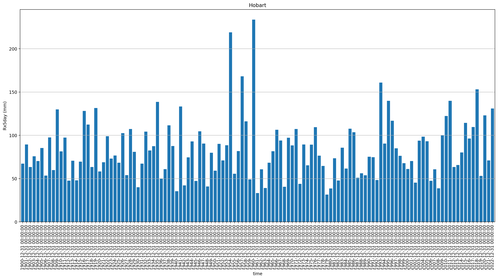
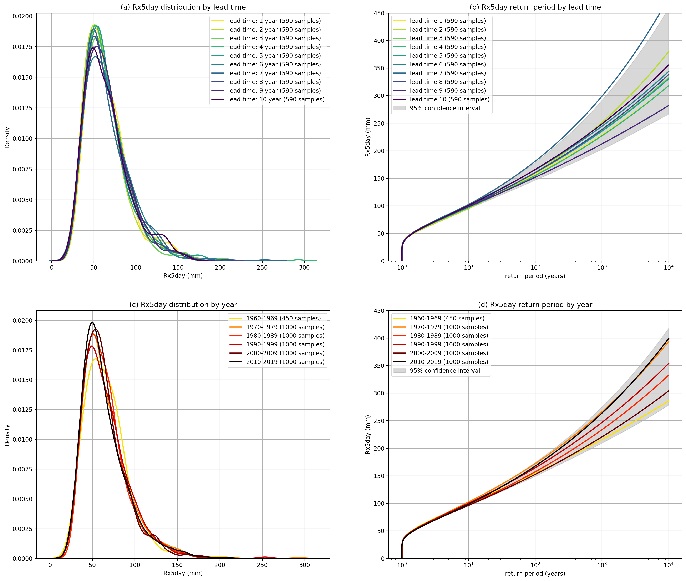
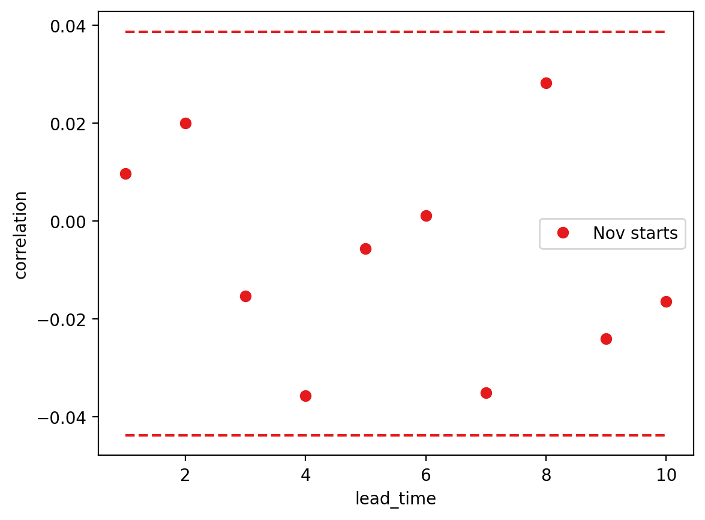
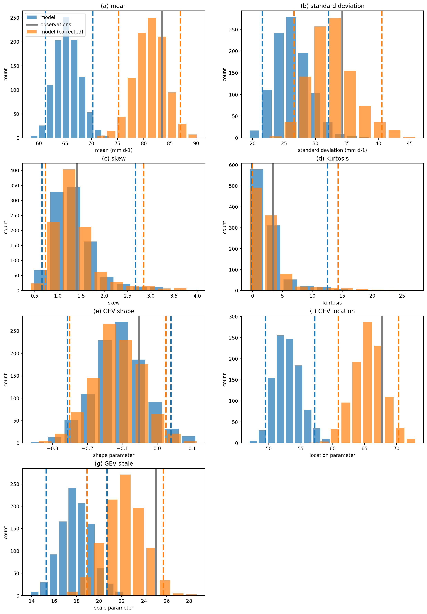

Worked examples
===============

Hobart extreme rainfall
------------------

During April of 1960,
a multi-day rainfall event caused severe flooding in Hobart
(see the `Tasmanian flood history <http://www.bom.gov.au/tas/flood/flood_history/flood_history.shtml#yr1960_1969>`__)
page for details).

In this worked example,
we'll estimate the likelihood of this record rainfall event by applying the UNSEEN approach to
a large forecast ensemble from the Decadal Climate Prediction Project (DCPP).

Observational data
^^^^^^^^^^^^^^^^^^

We can use the `AGCD data available on NCI <https://dx.doi.org/10.25914/6009600786063>`__:

.. code-block:: python

    import glob

    agcd_files = glob.glob('/g/data/zv2/agcd/v1-0-1/precip/total/r005/01day/agcd_v1-0-1_precip_total_r005_daily_*.nc')
    agcd_files.sort()
    print(agcd_files)

.. code-block:: none

    ['/g/data/zv2/agcd/v1-0-1/precip/total/r005/01day/agcd_v1-0-1_precip_total_r005_daily_1900.nc',
     '/g/data/zv2/agcd/v1-0-1/precip/total/r005/01day/agcd_v1-0-1_precip_total_r005_daily_1901.nc'
     ...
     '/g/data/zv2/agcd/v1-0-1/precip/total/r005/01day/agcd_v1-0-1_precip_total_r005_daily_2021.nc',
     '/g/data/zv2/agcd/v1-0-1/precip/total/r005/01day/agcd_v1-0-1_precip_total_r005_daily_2022.nc']

The ``fileio.open_dataset`` function can be used to open a data file/s as an xarray Dataset
and apply simple temporal and spatial aggregation.

We can use it extract the Hobart grid point from the AGCD data files
and apply the necessary temporal aggregation to calculate the commonly used Rx5day metric
(the highest annual 5-day rainfall total).

.. code-block:: python

    from unseen import fileio

    agcd_ds = fileio.open_dataset(
        agcd_files,
        variables=['pr'],
        point_selection=[-42.9, 147.3],
        rolling_sum_window=5,
        time_freq='A-DEC',
        time_agg='max',
        time_agg_dates=True,
        input_freq='D',
        metadata_file='../../config/dataset_agcd_daily.yml',
        units={'pr': 'mm day-1'},
    )

In addition to opening the AGCD files,
we've used the following keyword arguments:

-  ``metadata_file``: Edit the metadata of the data file / xarray Dataset according to the details in a :doc:`configuration file <configuration_files>`.
-  ``variables``: Select the precipitation variable from the Dataset.
-  ``point_selection``: Select the grid point nearest to Hobart (42.9 South, 147.3 East).
-  ``rolling_sun_window``, ``time_freq``, ``time_agg``: Calculate the Rx5day index.
-  ``time_agg_dates``: Record the date of the final day of each Rx5day event.

The docstring for the ``fileio.open_dataset`` function has the details for many other options,
including the use of shapefiles and lat/lon box coordinates for more sophisticated spatial
selection and aggregation.

.. code-block:: python

    print(agcd_ds)

.. code-block:: none

    <xarray.Dataset>
    Dimensions:     (time: 123)
    Coordinates:
      * time        (time) object 1900-12-31 00:00:00 ... 2022-12-31 00:00:00
    Data variables:
        pr          (time) float32 dask.array<chunksize=(1,), meta=np.ndarray>
        event_time  (time) <U28 '1900-04-17' '1901-04-25' ... '2022-05-08'
    Attributes: (12/33)
        geospatial_lat_min:        -44.525
        geospatial_lat_max:        -9.975
        geospatial_lon_min:        111.975
        geospatial_lon_max:        156.275
        time_coverage_start:       1899-12-31T09:00:00
        date_created:              2017-01-17T22:13:51.976225
        ...                        ...
        licence:                   Data Licence: The grid data files in this AGCD...
        description:               This AGCD data is a snapshot of the operationa...
        date_issued:               2023-05-19 06:19:17
        attribution:               Data should be cited as : Australian Bureau of...
        copyright:                 (C) Copyright Commonwealth of Australia 2023, ...
        history:

It can be a good idea to compute the Dataset before going too much further with the analysis,
otherwise the dask task graph can get out of control.

.. code-block:: python

   agcd_ds = agcd_ds.compute()

.. code-block:: python

   import pandas as pd

   years = agcd_ds['time'].dt.year.values
   agcd_df = pd.DataFrame(index=years)
   agcd_df['pr'] = agcd_ds['pr'].values
   agcd_df['event_time'] = agcd_ds['event_time'].values

   agcd_df['pr'].plot.bar(figsize=[20, 9], width=0.8)
   plt.ylabel('Rx5day (mm)')
   plt.title('Hobart')
   plt.grid(axis='y')
   plt.show()

.. code-block:: python

    ranked_years = agcd_df.sort_values(by='pr', ascending=False)
    print(ranked_years.head(n=10))

.. code-block:: none

                  pr  event_time
    1960  233.678711  1960-04-24
    1954  218.961914  1954-06-08
    1957  168.168945  1957-09-19
    1993  160.882812  1993-12-30
    2018  153.111328  2018-05-14
    2011  139.841797  2011-04-15
    1995  139.805664  1995-12-22
    1935  138.672852  1935-04-19
    1941  133.274414  1941-12-08
    1919  131.631836  1919-03-09

.. code-block:: python

    rx5day_max = ranked_years.iloc[0]['pr']

Analysis of the AGCD data shows that 20-24 April 1960 was indeed unprecented 5-day rainfall
total for Hobart with 234mm of rain falling.

We can fit a Generalised Extreme Value (GEV) distribution to the data
to get an estimate of the likelihood of the 1960 event.

.. code-block:: python

    from scipy.stats import genextreme as gev
    from unseen import eva

    agcd_shape, agcd_loc, agcd_scale = eva.fit_gev(agcd_ds['pr'].values)

    event_probability = gev.sf(rx5day_max, agcd_shape, loc=agcd_loc, scale=agcd_scale)
    event_return_period = 1. / event_probability
    event_percentile = (1 - event_probability) * 100

    print(f'{event_return_period:.0f} year return period')
    print(f'{event_percentile:.2f}% percentile\n')

.. code-block:: none

    297 year return period
    99.66% percentile

Model data
^^^^^^^^^^

The HadGEM3-GC31-MM submission to DCPP consists of multiple forecast files - twelve files (one for each year) for each initialisation date and ensemble member.
We can pass a text file listing all the input forecast files to ``fileio.open_mfforecast``
and it will sort and process them into a single xarray dataset.
We just need to order the files in the list by initialisation date and then ensemble member.
For example:

.. code-block:: none

    cat HadGEM3-GC31-MM_dcppA-hindcast_pr_files.txt

.. code-block:: none

    /g/data/oi10/replicas/CMIP6/DCPP/MOHC/HadGEM3-GC31-MM/dcppA-hindcast/s1960-r1i1p1f2/day/pr/gn/v20200417/pr_day_HadGEM3-GC31-MM_dcppA-hindcast_s1960-r1i1p1f2_gn_19601101-19601230.nc
    /g/data/oi10/replicas/CMIP6/DCPP/MOHC/HadGEM3-GC31-MM/dcppA-hindcast/s1960-r1i1p1f2/day/pr/gn/v20200417/pr_day_HadGEM3-GC31-MM_dcppA-hindcast_s1960-r1i1p1f2_gn_19610101-19611230.nc
    ...
    /g/data/oi10/replicas/CMIP6/DCPP/MOHC/HadGEM3-GC31-MM/dcppA-hindcast/s2018-r10i1p1f2/day/pr/gn/v20200417/pr_day_HadGEM3-GC31-MM_dcppA-hindcast_s2018-r10i1p1f2_gn_20280101-20281230.nc
    /g/data/oi10/replicas/CMIP6/DCPP/MOHC/HadGEM3-GC31-MM/dcppA-hindcast/s2018-r10i1p1f2/day/pr/gn/v20200417/pr_day_HadGEM3-GC31-MM_dcppA-hindcast_s2018-r10i1p1f2_gn_20290101-20290330.nc

.. code-block:: python

    model_ds = fileio.open_mfforecast(
        'HadGEM3-GC31-MM_dcppA-hindcast_pr_files.txt',
        n_ensemble_files=10,
        n_time_files=12,
        variables=['pr'],
        point_selection=[-42.9, 147.3],
        rolling_sum_window=5,
        time_freq='A-DEC',
        time_agg='max',
        time_agg_dates=True,
        input_freq='D',
        units={'pr': 'mm day-1'},
        reset_times=True,
        complete_time_agg_periods=True,
    )

We've used similar keyword arguments as for the AGCD data
(``open_mfforecast`` uses ``open_dataset`` to open each individual file)
with a couple of additions:

-  The ``n_ensemble_members`` and ``n_time_files`` arguments help the function sort the contents of the input file list
-  The ``reset_times`` option ensures that after resampling (e.g. here we calculate the annual mean from daily data) the month assigned to each time axis value matches the initialisation month
-  The ``complete_time_agg_periods`` argument makes sure that incomplete calendar years (e.g. the first year for a forecast that starts in November) aren't included

.. code-block:: python

   print(model_ds)

.. code-block:: none

    <xarray.Dataset>
    Dimensions:    (ensemble: 10, init_date: 59, lead_time: 12)
    Coordinates:
      * ensemble   (ensemble) int64 0 1 2 3 4 5 6 7 8 9
      * init_date  (init_date) object 1960-11-01 00:00:00 ... 2018-11-01 00:00:00
      * lead_time  (lead_time) int64 0 1 2 3 4 5 6 7 8 9 10 11
        time       (lead_time, init_date) object 1960-11-01 12:00:00 ... 2029-11-...
    Data variables:
        pr         (init_date, ensemble, lead_time) float32 nan 41.2 ... 14.04 nan
    Attributes: (12/43)
        Conventions:            CF-1.7 CMIP-6.2
        activity_id:            DCPP
        branch_method:          no parent
        branch_time_in_child:   0.0
        branch_time_in_parent:  0.0
        cmor_version:           3.4.0
        ...                     ...
        table_info:             Creation Date:(13 December 2018) MD5:f0588f7f55b5...
        title:                  HadGEM3-GC31-MM output prepared for CMIP6
        tracking_id:            hdl:21.14100/3163965c-a593-4abd-9b2a-9ee755aef228
        variable_id:            pr
        variable_name:          pr
        variant_label:          r1i1p1f2

If the ``open_mffdataset`` command takes too long to run,
you could also run it at the command line and submit to the job queue.

.. code-block:: none

    $ fileio HadGEM3-GC31-MM_dcppA-hindcast_pr_files.txt Rx5day_HadGEM3-GC31-MM_dcppA-hindcast_s1960-2018_gn_hobart.zarr.zip --n_ensemble_files 10 --variables pr --rolling_sum_window 5 --time_freq A-DEC --time_agg max --input_freq D --point_selection -42.9 147.3 --reset_times --complete_time_agg_periods --units pr=mm day-1 --forecast -v --n_time_files 12

Stability and stationarity testing
^^^^^^^^^^^^^^^^^^^^

Now that we have our Rx5day model data for Hobart,
we need to check whether the dataset is stable (no drift/trend with lead time)
and stationary (no trend with time).

To do this, we can use the ``stability`` module:

.. code-block:: python

    from unseen import stability

    stability.create_plot(
        model_ds['pr'],
        'Rx5day',
        [1960, 1970, 1980, 1990, 2000, 2010],
        uncertainty=True,
        return_method='gev',
        units='Rx5day (mm)',
        ylim=(0, 450),
    )

In this case, it looks like there isn't any model drift and trend over time.

Independence testing
^^^^^^^^^^^^^^^^^^^^

Next, we want to determine the lead time at which the ensemble members can be considered independent.
To do this, we can test whether the correlation between ensemble members at a given lead time is sufficiently close to zero.
At each lead time, the HadGEM3-GC31-MM submission to DCPP provides 10 (members), 59-year timeseries of annual mean rainfall
(spanning, e.g., 1961-2019 at 1-year lead, or 1965–2021 at 5-year lead).
We define our test statistic, $\rho_t$,
for each lead time as the mean Spearman correlation in time between all combinations of the 10 ensemble members
(of which there are 45: member 1 with 2, member 1 with 3 etc).
Significance of $\rho_t$ is estimated using a permutation test,
whereby 10,000 sets of 10 times 59 points are randomly drawn from the complete model dataset
to produce 10,000 estimates of the mean Spearman correlation.
Because these estimates are constructed from randomly drawn data,
they represent the distribution of mean correlation values for uncorrelated data (i.e., the null distribution).
Ensemble members are considered to be dependent (i.e., the null hypothesis of independence is rejected)
at a given lead time if $\rho_t$ falls outside of the 95\% confidence interval calculated from the randomly sampled distribution.

To perform this test, we can use the ``independence`` module:

.. code-block:: python

   from unseen import independence

   mean_correlations, null_correlation_bounds = independence.run_tests(model_ds['pr'])
   independence.create_plot(
       mean_correlations,
       null_correlation_bounds,
       'independence.png'
   )

Consistent with the stability analysis,
it's clear that all lead times are independent.

.. code-block:: python

    model_da_indep = model_ds['pr'].where(model_ds['lead_time'] > 0)
    model_da_indep.dropna('lead_time')

Bias correction
^^^^^^^^^^^^^^^

The final step in the model evaluation is to assess fidelity -
how well the model simulates the metric of interest (see below).
If the model fails the fidelity test/s,
it is common to bias correct the data
and then re-test to see whether it might be appropriate to use
bias corrected data for the likelihood analysis.
The most common bias correction method used in the UNSEEN literature to overcome model bias
in extreme precipitation is simple multiplicative mean scaling
(additive mean scaling tends to be used for temperature metrics),
whereby the model data is multiplied by the ratio of the average observed and modeled values.

To do this, we can use the ``bias_correction`` module:

.. code-block:: python

    from unseen import bias_correction

    correction_method = 'multiplicative'

    bias = bias_correction.get_bias(
        model_da_indep,
        agcd_ds['pr'],
        correction_method,
        time_rounding='A',
        time_period=['1961-01-01', '2018-12-31']
    )

    model_da_bc = bias_correction.remove_bias(model_da_indep, bias, correction_method)

We can plot both the raw and bias corrected model data against the observed
to see the effect of the bias correction.

.. code-block:: python

    import matplotlib.pyplot as plt

    model_da_indep.plot.hist(bins=50, density=True, alpha=0.7, facecolor='tab:blue')
    model_raw_shape, model_raw_loc, model_raw_scale = eva.fit_gev(model_da_indep.values, generate_estimates=True)
    model_raw_pdf = gev.pdf(xvals, model_raw_shape, model_raw_loc, model_raw_scale)
    plt.plot(xvals, model_raw_pdf, color='tab:blue', linewidth=4.0, label='model')

    model_da_bc.plot.hist(bins=50, density=True, alpha=0.7, facecolor='tab:orange')
    model_bc_shape, model_bc_loc, model_bc_scale = eva.fit_gev(model_da_bc.values, generate_estimates=True)
    model_bc_pdf = gev.pdf(xvals, model_bc_shape, model_bc_loc, model_bc_scale)
    plt.plot(xvals, model_bc_pdf, color='tab:orange', linewidth=4.0, label='model (corrected)')

    agcd_ds['pr'].plot.hist(ax=ax, bins=50, density=True, facecolor='tab:gray', alpha=0.7)
    plt.plot(xvals, agcd_pdf, color='tab:gray', linewidth=4.0, label='observations')

    plt.xlabel('Rx5day (mm)')
    plt.ylabel('probability')
    plt.title('Hobart')
    plt.xlim(0, 250)
    plt.legend()
    plt.grid()
    plt.show()

Fidelity testing
^^^^^^^^^^^^^^^

The most common fidelity test used in the UNSEEN literature is the so-called bootstrap or moments test,
whereby the model data is bootstrapped into a large number of (e.g. 1,000) series of equal length to the observed timeseries
and the empirical moments of each series (mean, standard deviation, skewness and kurtosis) are calculated.
If the moments of the observed timeseries fall within the 95% confidence intervals for the statistics derived from the bootstrapped series,
the model is considered to have passed the test.
In addition to these four basic empirical moments, some authors also calculate the shape, location and scale parameters
from a Generalised Extreme Value (GEV) distribution fit (using maximum likelihood estimation of the distribution parameters) to the data.

To perform the moments test, we can use the ``moments`` module:

.. code-block:: python

    from unseen import moments

    moments.create_plot(
        model_da_indep,
        agcd_ds['pr'],
        da_bc_fcst=model_da_bc,
    )

In order to avoid issues associated with multiple testing,
other authors prefer a single test score comparing the modeled and observed data.
The Kolmogorov–Smirnov test and Anderson-Darling test have been used to assess
how likely it is that the observed and model samples were drawn from the same (but unknown) probability distribution.
A test p-value of greater than 0.05 is typically taken to indicate that the null hypothesis
(that the two samples are from the same population) cannot be rejected,
meaning the model data is sufficiently similar to observations to be used in likelihood analysis.

To perform these similarity tests for both the raw and bias corrected model data,
we can use the ``similarity`` module:

.. code-block:: python

    from unseen import similarity

    similarity_ds = similarity.similarity_tests(model_da_indep, agcd_ds, 'pr')
    print('KS score:', similarity_ds['ks_statistic'].values)
    print('KS p-value:', similarity_ds['ks_pval'].values)
    print('AD score:', similarity_ds['ad_statistic'].values)
    print('AD p-value:', similarity_ds['ad_pval'].values)

.. code-block:: none

    KS score: 0.2797175
    KS p-value: 7.914835e-09
    AD score: 29.255798
    AD p-value: 0.001

.. code-block:: python

    similarity_bc_ds = similarity.similarity_tests(model_da_bc, agcd_ds, 'pr')
    print('KS score:', similarity_bc_ds['ks_statistic'].values)
    print('KS p-value:', similarity_bc_ds['ks_pval'].values)
    print('AD score:', similarity_bc_ds['ad_statistic'].values)
    print('AD p-value:', similarity_bc_ds['ad_pval'].values)

.. code-block:: none

    KS score: 0.07429516
    KS p-value: 0.49535686
    AD score: -0.15807883
    AD p-value: 0.25

The raw model data fails both tests (p-value < 0.05),
whereas the bias corrected data passes both (p-value > 0.05).

Results
^^^^^^^

Once we've got to the point where our data is procesed
and we are satisified that the observational and (independent, bias corrected) model data
have similar enough statistical distributions,
the unseen software has a number of functions to help to express our unpreecedented event
in the context of our large ensemble.

Once we've stacked our model data so it's one dimensional,

.. code-block:: python

   model_da_bc_stacked = model_da_bc.dropna('lead_time').stack({'sample': ['ensemble', 'init_date', 'lead_time']})
   print(model_da_indep_stacked)

.. code-block:: none

    <xarray.DataArray 'pr' (sample: 5900)>
    array([124.84209 ,  73.138466,  62.510113, ...,  57.245464, 121.23235 ,
            34.655647], dtype=float32)
    Coordinates:
        time       (sample) object 1961-11-01 12:00:00 ... 2028-11-01 12:00:00
      * sample     (sample) object MultiIndex
      * ensemble   (sample) int64 0 0 0 0 0 0 0 0 0 0 0 0 ... 9 9 9 9 9 9 9 9 9 9 9
      * init_date  (sample) object 1960-11-01 00:00:00 ... 2018-11-01 00:00:00
      * lead_time  (sample) int64 1 2 3 4 5 6 7 8 9 10 1 ... 10 1 2 3 4 5 6 7 8 9 10
    Attributes:
        standard_name:           lwe_precipitation_rate
        units:                   mm d-1
        bias_correction_method:  multiplicative
        bias_correction_period:  1970-01-01-2018-12-30

.. code-block:: python

    fig = plt.figure(figsize=[6, 4])
    ax = fig.add_subplot()
    eva.plot_gev_return_curve(
        ax,
        model_da_bc_stacked,
        rx5day_max,
        n_bootstraps=1000,
        direction="exceedance",
        ylabel='Rx5day (mm)',
        ylim=(0, 400),
    )
    plt.show()

.. code-block:: none

    235 year return period
    95% CI: 188-304 years

